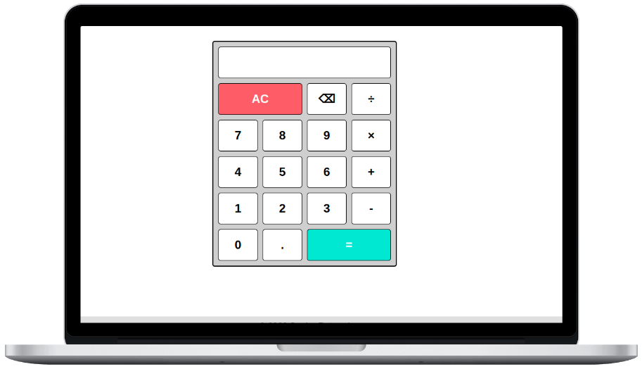

# Calculator

A simple JavaScript calculator which will do basic math calculations easily. It has click as well as keyboard support.

Try it out [here](https://sneharatnani.github.io/calculator/).

## Technologies Used

- HTML

- CSS

- JavaScript

This project is a part of [The Odin Project Curriculum](https://www.theodinproject.com/paths/foundations/courses/foundations/lessons/calculator).
